<!--  -->

<!-- 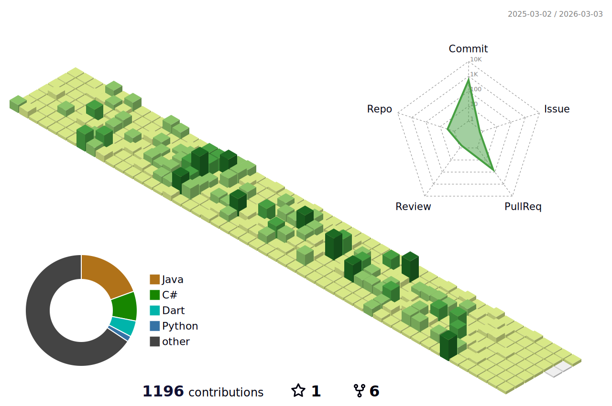 -->

> **도전을 두려워하지 않으며**  
> **늘 배움과 새로움에 적극적인 자세를 지닌**
> **프론트엔드 / 게임클라이언트 개발자 백지윤입니다.**

<!--  -->

## 📖 About Me

- **🎂 Birth**: 1999.05.05
- **✉️ E-Mail**: wendy6992@naver.com
- **🐱 GitHub**: [1234jienf](https://github.com/1234jienf)
- **💾 Tech Blog**: [My Posts](https://velog.io/@jyoon6992/posts)
- **📷 Instagram**: [Follow Me](https://www.instagram.com/bjy_devportfolio)

## ⛏️ Skills and Tools

| Category    | Technologies                                                                                                                                                                                                 |
|-------------|--------------------------------------------------------------------------------------------------------------------------------------------------------------------------------------------------------------|
| **Language**     |  |
| **Frontend**  |         |
| **Game Client**     |   |
| **Communication** |     |

## Solved.ac Ranking

## 🎓 Education

- 2023.07 ~ 현     재     삼성 청년 SW 아카데미 10기 재학중
- 2023.01 ~ 2023.07     콴다 과외 수학 선생님
- 2019.03 ~ 2023.08     한양대학교 실내건축디자인학과 (이학사) - 주전공
- 2019.03 ~ 2023.08     한양대학교 창업융합학과 - 복수전공

## 🙋‍♂️ My Approach to Development

- 개발 과정에서 항상 사용자의 입장을 생각해요.
- 여러 툴들을 주저하지 않고 익히려고 노력해요.
- 새로운 기술에 대한 공부를 끊임없이 하려고 해요.
- 꾸준하게 책을 읽으며 항상 성장하려고 노력해요.

## 🎒 Activities & Projects

### 📎 한양대학교 창업융합학과 프로젝트
- **프로젝트명**: 날씨 검색 애플리케이션
- **설명**: 창업실무와 모바일 앱 개발 수업에서 진행된 프로젝트로, 사용자 친화적인 날씨 정보 제공 앱을 개발.

### 📍 삼성 청년 SW 아카데미 10기 1학기
- **활동 기간**: 2023.07. ~ 2023.12
- **주요 내용**: 파이썬, 알고리즘, Vue, Django 등의 교육 이수와 프로젝트 수행.
- **프로젝트명**: 다산다 쇼핑몰 사이트 프로젝트(무신사 클론 코딩), 금융 애플리케이션 개발 프로젝트
  - **설명**: VUE를 이용하여 사용자 친화적인 디자인 및 기능 구현을 통해 정기예금/적금비교, MBTI 설문을 통한 성향 분석 등등의 서비스 구현
  - **GitHub 저장소**: [금융 상품 비교 FREDDIT](https://github.com/1234jienf/final-pjt)

### 📍 삼성 청년 SW 아카데미 10기 2학기
- **활동 기간**: 2024.02. ~ 2024.06
- **프로젝트**:
  1. **BID - 초등 교육 금융 플랫폼**
      - **설명**: 초등학생을 대상으로 한 경제 및 금융 교육을 위한 플랫폼 개발.
      - **GitHub 저장소**: [BID 프로젝트](https://github.com/1234jienf/B-D)
  2. **미슐랭 더 한양 - 전통 한식 요리 RPG**
     - **설명**: 전통 한식을 주제로 한 RPG 게임 개발.
     - **GitHub 저장소**: [미슐랭 더 한양](https://github.com/1234jienf/Michelin-de-Hanyang)
  3. **STEP TO DANCE - AI 춤 인식을 통한 춤교육 및 숏폼 생성 애플리케이션**
     - **설명**: 모션 인식 기술로 사용자의 춤을 분석하고 즉각적인 피드백을 제공하는 모바일 앱
     - **GitHub 저장소**: [STEP TO DANCE](https://github.com/SSAFY-A101/StepToDance)

## 📜 Certifications

- **OPIc**: Intermediate High
- **TOEIC**: Scored 860

## 🏆 Awards

- 제 9회 고속도로 공공디자인 공모전 (Oct 23, 2020)
  - 대학부 입선
  - 국토교통부 주최

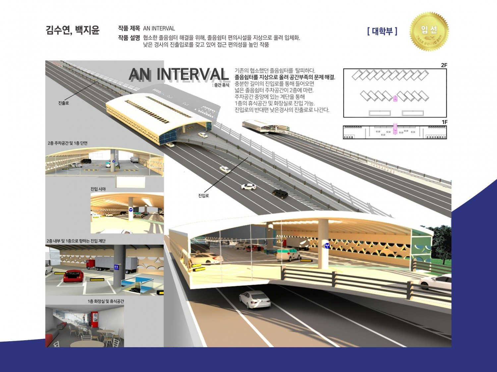

## 🔖 School Projects

**2020.09 - 2020.12 - 미래를 상상하다: 윤제주**
- 사용 기술 : RHINOCEROS, V-RAY RENDER

  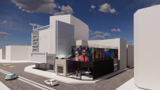
  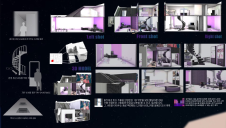
  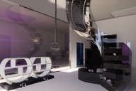

**2021.03 - 2021.06 - 가구디자인과 디지털 패브리케이션**
- 사용 기술 : RHINOCEROS

  
  
  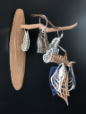

**2021.03 - 2021.06 - 넷플릭스, 결을 말하다**
- 사용 기술 : RHINOCEROS, AUTOCAD, ENSCAPE

  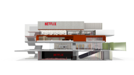
  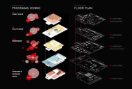
  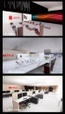
  

**2021.09 - 2021.12 - 성수동 구두골목 인쇄소 업사이클링 프로젝트**
- 사용 기술 : RHINOCEROS, ENSCAPE

  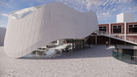
  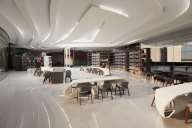
  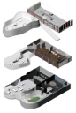

**2022.03 - 2022.11 - 감염병 대응 HUB**
- 사용 기술 : RHINOCEROS, TWIN MOTION, PHOTOSHOP

  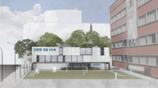
  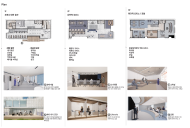
  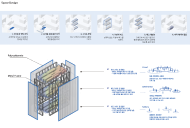

